# Highly Available 3-Tier Web Application on AWS - Phase 1

This document outlines the first phase of deploying a highly available, 3-tier web application architecture on AWS, including networking, custom AMI creation, and auto-scaling components.

---

## 1. Networking Infrastructure (VPC)

The foundation of the architecture is a custom VPC designed for high availability across multiple Availability Zones (AZs).

### Configuration Details:
- **Availability Zones:** `us-east-1a` and `us-east-1b`
- **Subnets:** Total of 4 subnets (2 Public for Load Balancer, 2 Private for Application instances)
- **Internet Gateway (IGW):** Attached to the public route table to provide internet access for the public subnets.

#### Visual Verification:
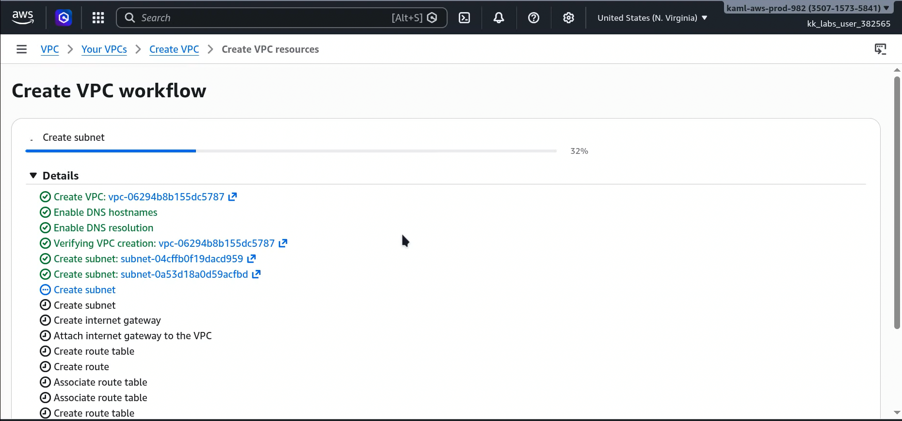
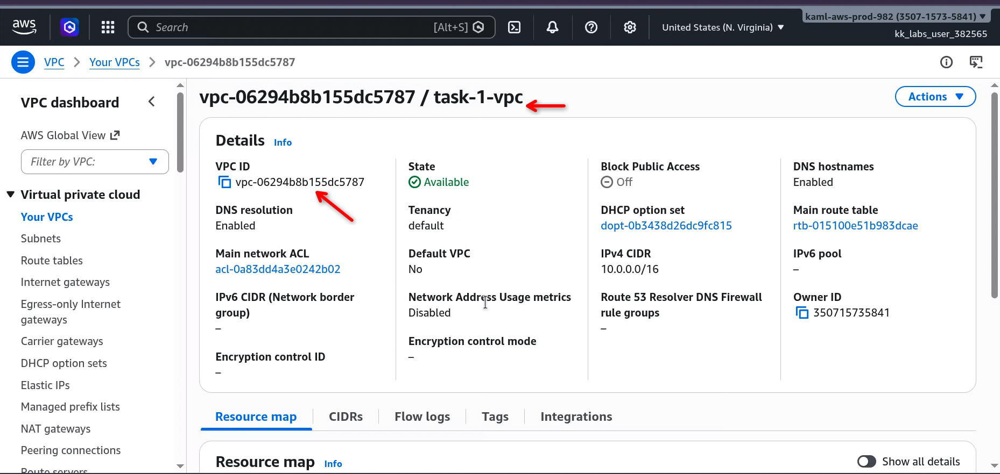
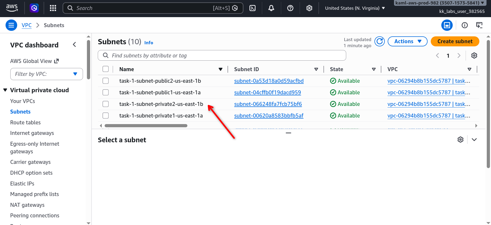
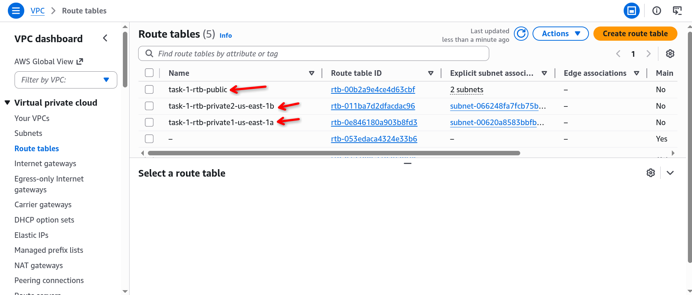

---

## 2. Custom AMI Creation

To ensure rapid scaling and consistent deployments, a custom Amazon Machine Image (AMI) is used.

### Pre-configuration (Userdata Script)
A script is used during the initial instance launch to install Nginx and deploy the application code automatically.

```bash
#!/bin/bash
# Update and install dependencies
apt-get update -y
apt-get install -y nginx git

# Clean default web root
rm -rf /var/www/html/*

# Clone application repository
git clone https://github.com/schoolofdevops/html-sample-app /var/www/html/

# Set permissions
chown -R www-data:www-data /var/www/html/
chmod -R 755 /var/www/html/

# Restart service
systemctl restart nginx
```

### AMI Creation Steps:
1. Launch an EC2 instance with the userdata script above.
2. Verify that the application is running as expected.
3. In the EC2 Console, select the instance.
4. Go to **Actions** > **Image and templates** > **Create Image**.

#### Visual Verification:
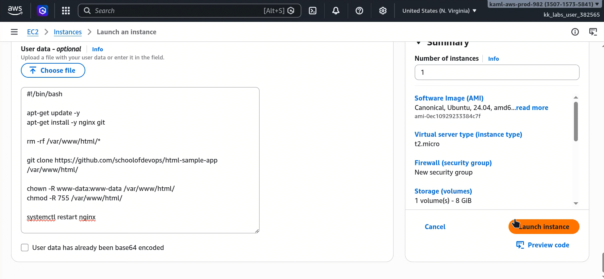
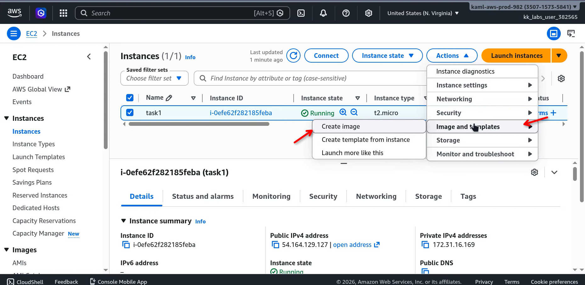
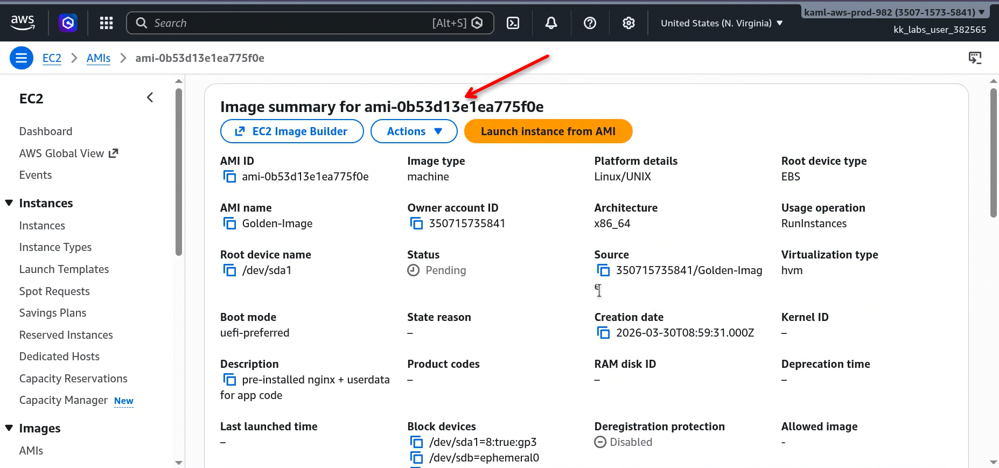

---

## 3. Launch Template Setup

The Launch Template defines the blueprint for instances that the Auto Scaling Group will launch.

- **AMI:** Use the custom AMI created in Step 2.

- **Instance Type:** `t2.micro`.

- **Auto-Scaling Guidance:** Enable guidance for easier integration.

- **Security Group:** Create a new group allowing traffic on ports `80` (HTTP) and `22` (SSH).

- **Storage:** Attach an 8 GB EBS volume (standard restriction).

- **Encryption:** Enable default EBS encryption.


  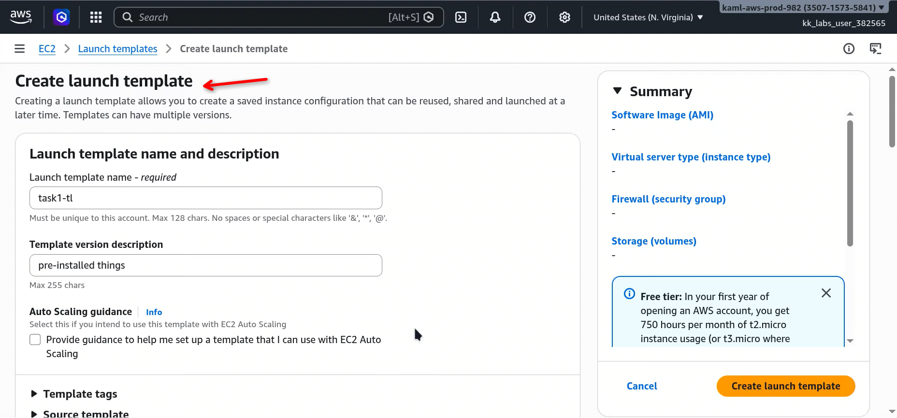


​	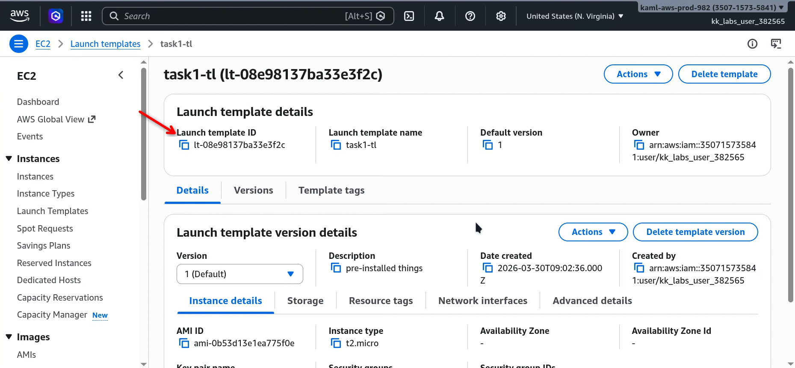

---

## 4. Application Load Balancer (ALB) & Target Group

The ALB distributes incoming traffic across the instances in the private subnets.

### ALB Configuration:
- **Protocol:** HTTP (Port 80). *Note: HTTPS is unavailable in this environment.*
- **Networking:** Distributed across two Availability Zones for high availability.
- **Security Group:** Assign the security group created previously.
- **Attributes:** Enable **Stickiness** with a 1-hour duration to maintain user sessions.

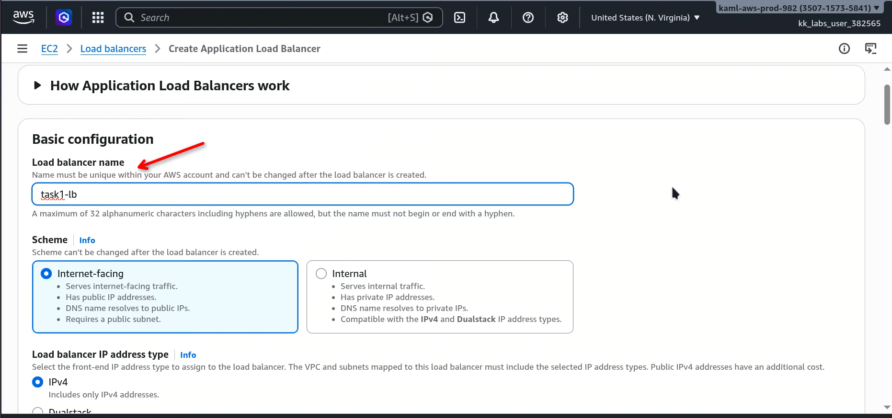

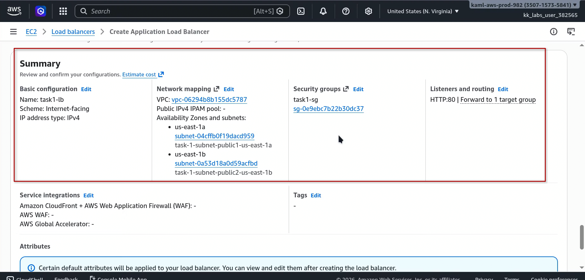

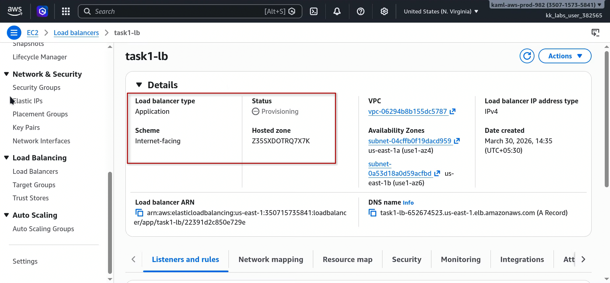

### Target Group:

- Create a target group for the application instances.
- *Note: Do not manually attach instances; let the ASG manage registration.*


  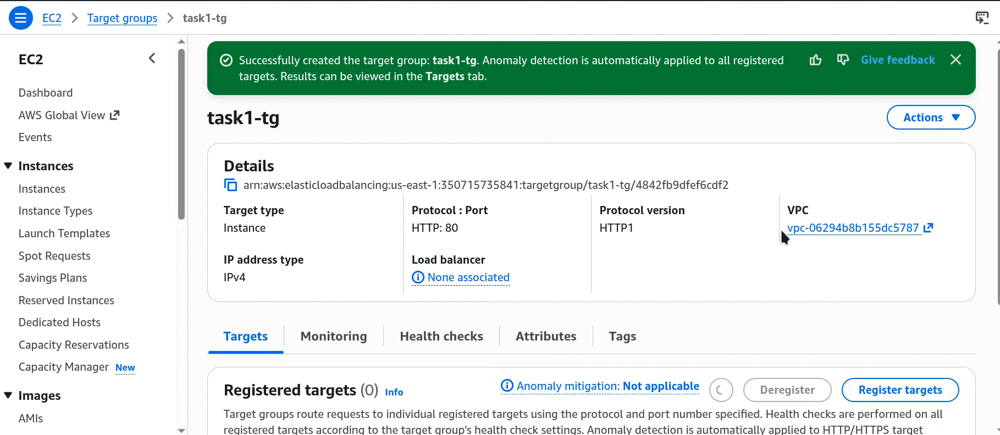

  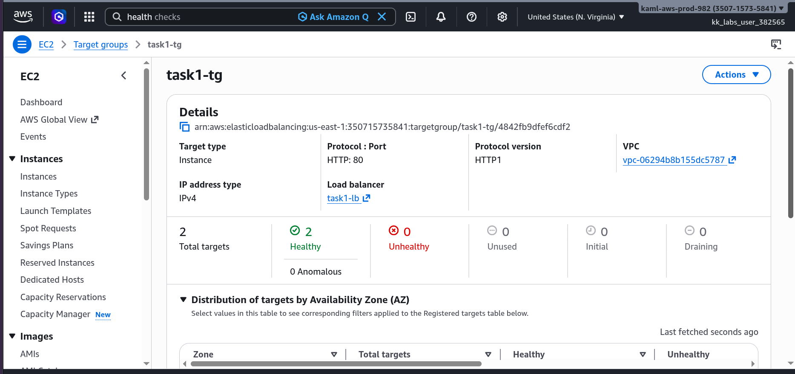

---

## 5. Auto Scaling Group (ASG)

The ASG ensures that the application maintains its desired capacity and scales based on traffic demand.

### Scaling Parameters:
- **Template:** Use the Launch Template defined in Step 3.
- **ALB/TG:** Attach the ALB and Target Group.
- **Capacity:**
  - **Min:** 2
  - **Max:** 6
  - **Desired:** 2
- **Scaling Policies:**
  - **Scale Out (Target Tracking):** Triggered when CPU utilization > 60%.
  - **Scale In (Step Scaling):** Triggered when CPU utilization < 30%.
- **Cooldown:** 300 seconds.


  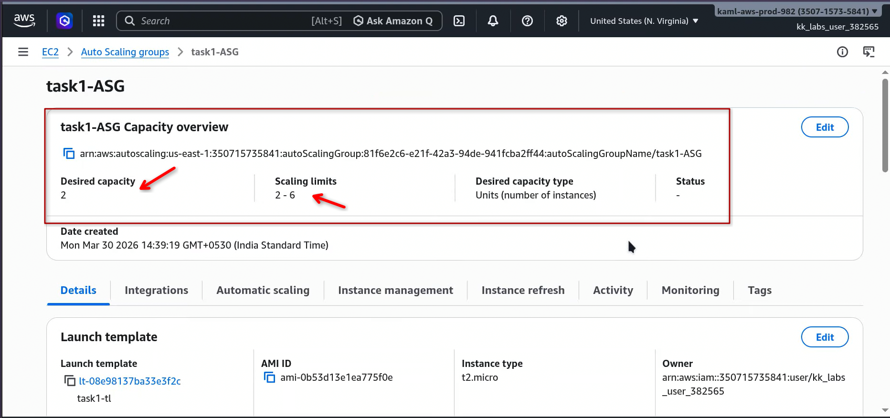
  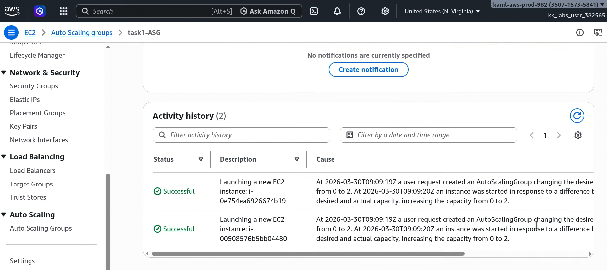

  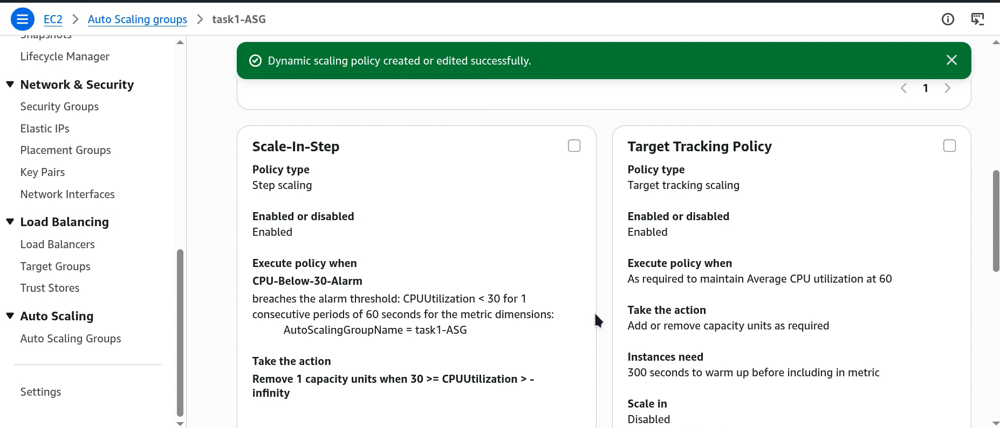

### Configuring Termination Policy:
To ensure predictable termination of instances during scale-in events:
1. Navigate to **Auto Scaling Groups** in the AWS console.
2. Select your specific Auto Scaling group.
3. On the **Details** tab, find **Advanced configurations** and click **Edit**.
4. In the **Termination policies** section, select and order your preferred policies (e.g., *OldestInstance*).
5. Save the changes.

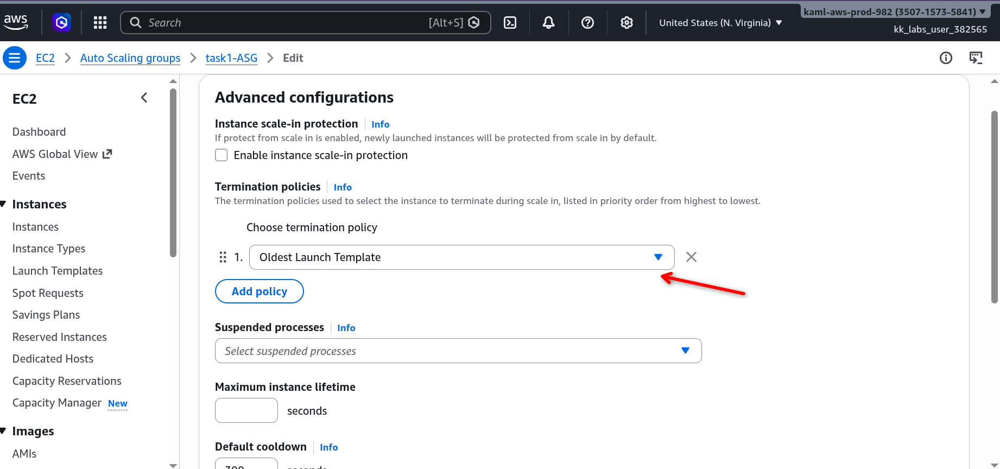

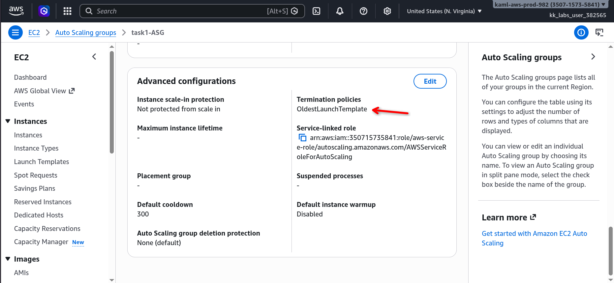


### Creation of S3 bucket:


